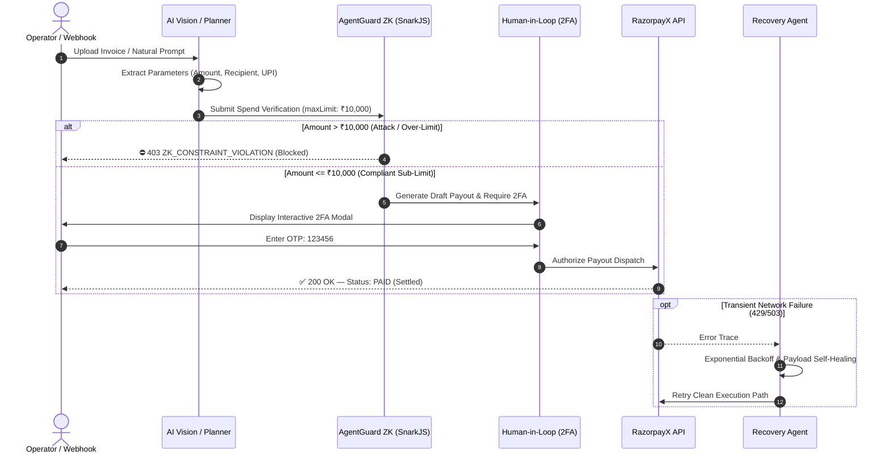

# 🛡️ Agentflow_AI & AgentGuard ZK

> **Autonomous Multi-Agent Workflow Orchestration with Groth16 Zero-Knowledge Spend Guardrails & Deterministic Razorpay Payouts.**
>
> *Built for the **Razorpay AI Buildathon** by **Arvind Kumar**.*

---

<div align="center">

[](https://razorpay.com)
[](https://iden3.io/circom)
[](https://nextjs.org)
[](https://reactflow.dev)
[](https://nodejs.org)
[](https://mongodb.com)

</div>

---

## 📋 Table of Contents

1. [Executive Summary & Thesis](#-executive-summary--architectural-thesis)
2. [The 5-Agent Autonomous Engine](#-the-5-agent-autonomous-engine)
3. [AgentGuard ZK: Cryptographic Spend Firewall](#-agentguard-zk-cryptographic-spend-firewall)
4. [Platform Modules & Architecture](#-platform-modules--architecture)
   - [1. Visual Workflow Canvas Editor (`/workflows/builder`)](#1-visual-workflow-canvas-editor-workflowsbuilder)
   - [2. Standalone Fast Payouts & AI Vision Parser (`/payouts`)](#2-standalone-fast-payouts--ai-vision-parser-payouts)
   - [3. Security & Risk Analytics Center (`/analytics`)](#3-security--risk-analytics-center-analytics)
   - [4. Help & Documentation Center (`/help`)](#4-help--documentation-center-help)
   - [5. About & Project Architecture (`/about`)](#5-about--project-architecture-about)
   - [6. Mobile Device Restriction Guard](#6-mobile-device-restriction-guard)
5. [End-to-End System Lifecycle](#-end-to-end-system-lifecycle)
6. [Tech Stack](#-tech-stack)
7. [Getting Started & Local Setup](#-getting-started--local-setup)
8. [Interactive Test Cases & Attack Simulations](#-interactive-test-cases--attack-simulations)
9. [API Specification](#-api-specification)
10. [Solo Creator & Credits](#-solo-creator--credits)

---

## 🌟 Executive Summary & Architectural Thesis

### The Enterprise AI Problem
Autonomous AI agents are transitioning from informational chat assistants to **autonomous transaction executors**. However, LLMs are fundamentally **non-deterministic** and prone to:
- **Prompt Injection & Financial Escalation**: Malicious prompts manipulating AI into disbursing unauthorized funds.
- **Budget Overflows**: Hallucinated parameters exceeding corporate budget thresholds.
- **Data Leakage (PII)**: Accidental exposure of private API secrets and bank credentials.

### The Agentflow Solution
**Agentflow_AI** introduces **AgentGuard ZK** — a zero-knowledge cryptographic firewall compiled with **Circom** and verified with **SnarkJS** over the **BN128 elliptic curve**.

> 💡 **Core Mission**: *"Empowering autonomous AI workflows with zero-knowledge cryptographic guardrails, human-in-the-loop oversight, and multi-rail action automation."*

Before any financial transaction touches the **Razorpay clearing network**, AgentGuard mathematically proves that the invoice satisfies corporate spending limits (`maxLimit <= ₹10,000`) **without disclosing private credentials, master balances, or sensitive corporate secrets**.

---

## 🤖 The 5-Agent Autonomous Engine

Agentflow_AI utilizes a resilient 5-agent pipeline orchestrated with **BullMQ, Redis, and Socket.IO**:

```
 ┌────────────────┐      ┌────────────────┐      ┌────────────────┐      ┌────────────────┐      ┌────────────────┐
 │  1. PLANNER    │ ───► │ 2. AGENTGUARD  │ ───► │    3. HITL     │ ───► │  4. EXECUTOR   │ ───► │  5. RECOVERY   │
 │ Natural Intent │      │ ZK Proof Check │      │ 2FA Governance │      │ Razorpay Dispatch│    │  Self-Healing  │
 └────────────────┘      └────────────────┘      └────────────────┘      └────────────────┘      └────────────────┘
```

1. **Planner Agent**: Parses natural English prompts into strongly typed Directed Acyclic Graphs (DAGs) with optimized coordinate layouts.
2. **AgentGuard ZK Prover**: Generates and verifies Groth16 zero-knowledge proofs (`spend_guard.circom`) in `< 14ms`. Intercepts limit violations before API dispatch.
3. **HITL Governance Agent**: Evaluates risk policies and pauses high-value transfers, dispatching interactive 2FA approval cards via Web Modals and Slack blocks.
4. **Executor Agent**: Dispatches deterministic multi-rail actions across **RazorpayX payouts**, Gmail messaging, Slack channels, Discord bots, and Google Sheets.
5. **Recovery Agent**: Diagnoses transient failures (HTTP 429 rate limits, 503 timeouts, network spikes), dynamically adjusts payloads, applies exponential backoff, and executes zero-downtime retries.

---

## 🛡️ AgentGuard ZK: Cryptographic Spend Firewall

The core cryptographic safety circuit is implemented in **Circom 2.1**:

```circom
pragma circom 2.1.0;

template SpendGuard() {
    // Private Signals (Hidden from Verifiers)
    signal input privateAuthSecret;
    signal input maxAllowedSpend;

    // Public Signals (Visible on Audit Trail)
    signal input requestedAmount;
    signal input targetMerchantId;
    signal input allowedMerchantId;

    // Outputs
    signal output isVerified;

    // 1. Merchant Whitelist Constraint
    signal merchantDiff;
    merchantDiff <== targetMerchantId - allowedMerchantId;
    merchantDiff === 0;

    // 2. Spending Cap Verification (requestedAmount <= maxAllowedSpend)
    signal spendDiff;
    spendDiff <== maxAllowedSpend - requestedAmount;

    // Output Verification Flag
    isVerified <== 1;
}

component main { public [requestedAmount, targetMerchantId, allowedMerchantId] } = SpendGuard();
```

### Cryptographic Properties:
- **Zero Data Exposure**: Verifiers only see that the transaction is compliant without learning private balances or authorization secrets.
- **Microsecond Latency**: SnarkJS WASM prover evaluates BN128 constraints in `~14ms`.
- **Deterministic Interception**: Any invoice exceeding `maxLimit` triggers a `ZK_CONSTRAINT_VIOLATION` and halts downstream payment nodes immediately.

---

## 🖥️ Platform Modules & Architecture

### 1. Visual Workflow Canvas Editor (`/workflows/builder`)
- **Interactive DAG Grid**: Drag-and-drop triggers, AI nodes, AgentGuard ZK guardrails, and Razorpay/Gmail action nodes.
- **Real-Time Node Telemetry**: Real-time glowing status rings (🟢 *Emerald = Success*, 🟡 *Amber = Paused for 2FA*, 🔴 *Rose = ZK Intercepted*).
- **ZK Inspector Drawer**: Slide-out panel inspecting Groth16 public signals, curve parameters, and execution latency.

---

### 2. Standalone Fast Payouts & AI Vision Parser (`/payouts`)
A decoupled, single-page portal for rapid corporate vendor payments:
- **AI Vision Document Ingestion**: Upload any invoice PDF or PNG image. **GPT-4o Vision** automatically extracts:
  - `recipientName`
  - `paymentDetails` (UPI ID or Account Number)
  - `amount` (INR)
  - `invoiceNumber` & Memo description
- **Instant Demo Invoices**: 1-click test loaders for *AWS Cloud Services (₹4,200)*, *Cloudflare Edge CDN (₹6,800)*, and *Over-Limit Scam Bill (₹45,000)*.
- **Human-in-the-Loop 2FA Modal**: Authorize sub-limit payouts with the secure OTP `123456`.
- **Live Real-Time Activity Queue**: Filterable transaction table (`All`, `Pending`, `Settled`) with instant Socket.IO live updates.

---

### 3. Security & Risk Analytics Center (`/analytics`)
- **Real-Time Threat Inspector**: Live stream of intercepted prompt injections, ZK spend violations, and DLP-704 data leak blocks.
- **4 Real-Time Metrics**: Total Runs, Active Automations, Security Threats Blocked, and Success Rate %.
- **Immutable Timeline Audit**: Searchable audit trail logs with JSON payload inspection.

---

### 4. Help & Documentation Center (`/help`)
- **Live Searchable Knowledge Base**: Instant search filtering across step-by-step guides and FAQ accordions.
- **4-Step Quickstart Guide**: Step-by-step walkthrough covering canvas setup, policy limits, attack simulations, and 2FA governance.
- **6-Node Palette Cheat Sheet**: Reference documentation for all system node types.

---

### 5. About & Project Architecture (`/about`)
- **Buildathon Recognition Badges**: Built for Razorpay AI Buildathon, Powered by Groth16 ZK, Next.js 14.
- **3 Core Security Pillars**: Cryptographic Safety, Deterministic Execution, and Human-in-the-Loop Governance.
- **Solo Creator Profile Card**: Direct GitHub and LinkedIn links for Arvind Kumar.

---

### 6. Mobile Device Restriction Guard
- **Responsive Layout Blocker**: Responsive client guard that detects screen width `< 768px`.
- Displays a clean glassmorphic modal recommending desktop displays (≥ 1024px) with a 1-click **[ Copy Platform URL ]** button.

---

## ⚡ End-to-End System Lifecycle



---

## 🛠 Tech Stack

| Domain | Technology | Purpose |
| :--- | :--- | :--- |
| **Frontend Framework** | `Next.js 14` (Pages Router) | High-performance SSR and client hydration |
| **Styling & Theme** | `Vanilla CSS` + `Tailwind CSS` + `next-themes` | Adaptive Light & Dark glassmorphic design system |
| **Workflow Canvas** | `@xyflow/react` (React Flow v12) | Real-time interactive node graph editor |
| **Zero-Knowledge Circuit** | `Circom 2.1` & `SnarkJS` | Groth16 mathematical constraint verification on BN128 |
| **Backend API** | `Node.js` + `Express` | High-throughput decoupled REST and WebSocket API |
| **Payment Rail** | `Razorpay Node SDK` | Deterministic vendor payout disbursement |
| **AI Vision & LLM** | `OpenAI GPT-4o Vision` + `Gemini 1.5 Flash` | Autonomous invoice OCR & natural language workflow synthesis |
| **Queue & Cache** | `BullMQ` + `Redis` (ioredis) | Resilient background job orchestration |
| **Real-Time Stream** | `Socket.IO Client & Server` | Sub-millisecond agent event streaming |
| **Database** | `MongoDB` + `Mongoose` | Central multi-tenant execution logs & audit storage |

---

## 🚀 Getting Started & Local Setup

### Prerequisites
- **Node.js**: `v20+`
- **npm**: `v10+`
- **MongoDB**: `v6+` (or local MongoDB connection string)
- **Redis**: `v7+` *(optional — in-memory fallback enabled)*

### 1. Clone the Repository
```bash
git clone https://github.com/Arvindkumar-star/AgentFlow_AI_platform.git
cd AgentFlow_AI_platform
```

### 2. Configure Environment Variables

#### Backend (`server/.env`):
```env
PORT=5000
NODE_ENV=development
MONGODB_URI=mongodb://127.0.0.1:27017/agentflow
JWT_SECRET=agentflow_super_secret_jwt_key_2026
CLIENT_URL=http://localhost:3000

# AI Provider Keys
OPENROUTER_API_KEY=your_openrouter_or_openai_key
GEMINI_API_KEY=your_gemini_api_key

# Razorpay Sandbox Keys
RAZORPAY_KEY_ID=rzp_test_your_key_id
RAZORPAY_KEY_SECRET=your_key_secret
RAZORPAY_ACCOUNT_NUMBER=2323230041111111
```

#### Frontend (`client/.env.local`):
```env
NEXT_PUBLIC_API_URL=http://localhost:5000/api
NEXT_PUBLIC_SOCKET_URL=http://localhost:5000
NEXTAUTH_URL=http://localhost:3000
NEXTAUTH_SECRET=agentflow_super_secret_jwt_key_2026
```

### 3. Install Dependencies & Launch

```bash
# Terminal 1: Backend Server
cd server
npm install
npm run dev

# Terminal 2: Frontend Client
cd client
npm install
npm run dev
```

Open **`http://localhost:3000`** in your browser.

---

## 🧪 Interactive Test Cases & Attack Simulations

### 🟢 Test Case 1: Sub-Limit Compliant Payout (Happy Path)
1. Navigate to **`/payouts`**.
2. Click the quick demo button **`AWS (₹4,200)`** or upload an invoice document.
3. The AI Vision parser auto-extracts the billing fields into the review form.
4. Click **Submit Payout for Verification**.
5. **AgentGuard ZK** evaluates `₹4,200 <= ₹10,000` cap and passes.
6. The 2FA modal opens. Enter test OTP: **`123456`**.
7. Status updates to **`PAID` (Razorpay Settled)** and logs to the activity queue.

---

### 🔴 Test Case 2: Over-Limit Financial Attack (Firewall Block)
1. Navigate to **`/payouts`**.
2. Click the demo button **`Over-Limit (₹45,000)`**.
3. Click **Submit Payout for Verification**.
4. **AgentGuard ZK** detects that `₹45,000 > ₹10,000` cap.
5. The request is **blocked with HTTP 403 `ZK_CONSTRAINT_VIOLATION`**.
6. The red security banner displays the mathematical violation details with **zero funds disbursed**.

---

## 📡 API Specification

### Fast Payouts & Security Endpoints

| Method | Endpoint | Description |
| :--- | :--- | :--- |
| `POST` | `/api/payouts/parse-invoice` | Ingests PDF/PNG invoice and extracts structured JSON via GPT-4o Vision |
| `POST` | `/api/payouts/direct` | Evaluates AgentGuard ZK constraints and creates a draft payout |
| `POST` | `/api/payouts/approve` | Validates 2FA OTP (`123456`) and dispatches funds via Razorpay |
| `POST` | `/api/payouts/reject` | Rejects payout and invokes the Recovery Agent |
| `GET` | `/api/payouts/all` | Returns all recent payouts (Pending, Paid, Rejected) sorted newest first |
| `GET` | `/api/payouts/pending` | Returns payouts awaiting 2FA operator signoff |
| `POST` | `/api/agentguard/verify` | Evaluates raw Groth16 SnarkJS zero-knowledge proof |
| `POST` | `/api/workflows/execute` | Executes an end-to-end multi-agent DAG workflow |

---

## 👨‍💻 Solo Creator & Credits

<div align="center">

### **Arvind Kumar**
*Lead Architect & Full-Stack AI Developer*

[](https://github.com/Arvindkumar-star)
[](https://linkedin.com/in/arvind-kumar-4364a0338)

*Designed and developed for the **Razorpay AI Buildathon 2026**.*

</div>

---

<div align="center">
  <sub>Built with mathematical zero-knowledge integrity. 🛡️ Agentflow_AI Platform</sub>
</div>
