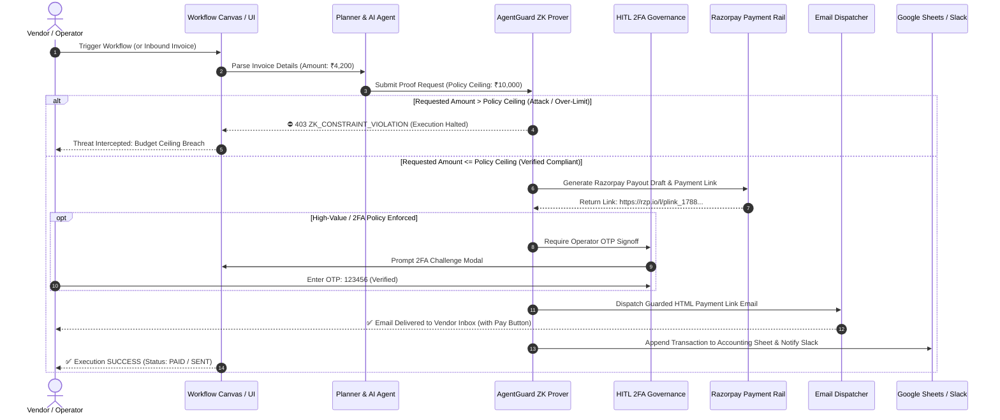

# 🛡️ Agentflow AI & AgentGuard ZK

> **Autonomous Enterprise AI Agent Platform with Groth16 Zero-Knowledge Spend Guardrails & Deterministic Razorpay Payouts.**
>
> *Built for the **Razorpay AI Buildathon 2026** by **Arvind Kumar**.*

---

<div align="center">

[](https://razorpay.com)
[](https://drive.google.com/file/d/1WUK-8hWtNuZloXblGk8SlcuWsAKyr0bX/view)
[](https://agent-flow-ai-platform-8urivuer1-arvinds-projects-bc1cdb31.vercel.app)
[](https://iden3.io/circom)
[](https://nextjs.org)
[](https://nodejs.org)
[](https://mongodb.com)

</div>

---

## 🔗 Quick Links & Live Demonstrations

| Resource | URL / Link | Description |
| :--- | :--- | :--- |
| **🎬 Live Demo Video** | [Watch Google Drive Video ↗](https://drive.google.com/file/d/1WUK-8hWtNuZloXblGk8SlcuWsAKyr0bX/view) | Complete 5-minute technical platform walkthrough & live execution |
| **🚀 Production Web App** | [Open Live Platform ↗](https://agent-flow-ai-platform-8urivuer1-arvinds-projects-bc1cdb31.vercel.app) | Live multi-tenant web platform with visual canvas & fast payouts |
| **📦 GitHub Repository** | [AgentFlow_AI_platform ↗](https://github.com/Arvindkumar-star/AgentFlow_AI_platform) | Full-stack source code, Circom ZK circuits, and server agents |
| **⚡ Fast Payouts Portal** | [Open Fast Payouts ↗](https://agent-flow-ai-platform-8urivuer1-arvinds-projects-bc1cdb31.vercel.app/payouts) | 1-Click AI Vision invoice parser, 2FA OTP modal, and Razorpay dispatch |
| **🛡️ Risk & Analytics Center** | [Open Risk Analytics ↗](https://agent-flow-ai-platform-8urivuer1-arvinds-projects-bc1cdb31.vercel.app/analytics) | Real-time SnarkJS telemetry, ZK constraints inspector, and threat audit trail |

---

## 📋 Table of Contents

1. [Executive Summary & The Problem](#-executive-summary--the-problem)
2. [💳 Flagship: Razorpay Autonomous Financial Infrastructure](#-flagship-razorpay-autonomous-financial-infrastructure)
   - [1. Razorpay Payouts & Automated Disbursements](#1-razorpay-payouts--automated-disbursements)
   - [2. Hosted Razorpay Payment Links (`rzp.io`)](#2-hosted-razorpay-payment-links-rzpio)
   - [3. Guarded Automated Email Dispatch System](#3-guarded-automated-email-dispatch-system)
   - [4. Human-In-The-Loop (HITL) 2FA OTP Governance](#4-human-in-the-loop-hitl-2fa-otp-governance)
   - [5. AI Vision Document Ingestion (OCR)](#5-ai-vision-document-ingestion-ocr)
3. [🛡️ AgentGuard ZK: Cryptographic Spend Firewall](#️-agentguard-zk-cryptographic-spend-firewall)
   - [Circom 2.1 Circuit Implementation](#circom-21-circuit-implementation)
   - [Mathematical Zero-Knowledge Proof Vectors](#mathematical-zero-knowledge-proof-vectors)
   - [Interactive Attack & Scam Simulator](#interactive-attack--scam-simulator)
4. [🌐 Beyond Payments: Omnichannel Task Automation & Multi-Platform Integrations](#-beyond-payments-omnichannel-task-automation--multi-platform-integrations)
   - [Supported Integrations & Connected Rails](#supported-integrations--connected-rails)
   - [Real-World Enterprise Multi-App Workflows](#real-world-enterprise-multi-app-workflows)
5. [🤖 The 5-Agent Autonomous Orchestration Engine](#-the-5-agent-autonomous-orchestration-engine)
6. [🖥️ Interactive Platform Modules](#️-interactive-platform-modules)
7. [⚡ End-to-End System Execution Lifecycle](#-end-to-end-system-execution-lifecycle)
8. [🛠️ Tech Stack & Architecture](#️-tech-stack--architecture)
9. [🚀 Local Setup & Getting Started](#-local-setup--getting-started)
10. [📡 Comprehensive API Specification](#-comprehensive-api-specification)
11. [👨‍💻 Solo Creator & Hackathon Credits](#-solo-creator--hackathon-credits)

---

## 🌟 Executive Summary & The Problem

### The Enterprise AI Dilemma
Autonomous AI agents are rapidly evolving from informational chatbots to **autonomous transaction executors** capable of reading invoices, approving orders, and disbursing funds. However, LLMs are fundamentally **non-deterministic** and vulnerable to:
- **Hallucinated Financial Parameters**: Generating inaccurate amounts, duplicate orders, or corrupted bank accounts.
- **Prompt Injection & Financial Escalation**: Attackers tricking AI agents via email/PDF payloads into sending treasury funds to unauthorized accounts.
- **Data & Credential Exfiltration (PII)**: Accidental leakage of internal budget balances, API keys, or corporate banking secrets.

### The Agentflow Solution
**Agentflow AI** bridges **Razorpay’s high-throughput payment infrastructure** with **AgentGuard ZK** — a zero-knowledge cryptographic firewall compiled with **Circom** and verified using **SnarkJS** over the **BN128 elliptic curve**.

```
┌────────────────────────────────────────────────────────────────────────────────────────────────────────┐
│                                       AGENTFLOW AI ARCHITECTURE                                        │
│                                                                                                        │
│   Inbound Trigger          AgentGuard ZK Firewall              Razorpay Engine           Live Delivery │
│  ┌────────────────┐     ┌───────────────────────────┐     ┌───────────────────────┐   ┌──────────────┐ │
│  │ Invoices, OCR, │ ──► │  Groth16 SnarkJS Prover   │ ──► │ Razorpay Payouts &    │ ─►│ Resend/SMTP  │ │
│  │ Gmail, Webhook │     │  284 R1CS Constraints     │     │ Hosted Payment Links  │   │ Real Emails  │ │
│  └────────────────┘     │  Deterministic Cap Check  │     │ (rzp.io/l/...)        │   │ Vendor Inbox │ │
│                         └───────────────────────────┘     └───────────────────────┘   └──────────────┘ │
│                                       │                              │                                 │
│                                       ▼                              ▼                                 │
│                         ┌───────────────────────────┐     ┌───────────────────────┐                    │
│                         │ If Limit Breached (>₹10k) │     │ HITL 2FA OTP Check    │                    │
│                         │ ⛔ HALTED (0 Rupee Risk)  │     │ (123456 Challenge)    │                    │
│                         └───────────────────────────┘     └───────────────────────┘                    │
└────────────────────────────────────────────────────────────────────────────────────────────────────────┘
```

> 💡 **Core Mission**: Before any transaction reaches the **Razorpay payment network**, AgentGuard mathematically proves that the invoice strictly complies with corporate spending policies (`requestedAmount <= policyCeiling`) **without disclosing private corporate balances, master keys, or internal budget allocations**.

---

## 💳 Flagship: Razorpay Autonomous Financial Infrastructure

The payment engine is the dominant core of Agentflow AI, providing enterprise-grade financial capabilities natively integrated into every autonomous workflow.

### 1. Razorpay Payouts & Automated Disbursements
* **Direct Bank & UPI Transfers**: Generates strongly-typed Razorpay Payout drafts with account numbers, IFSC, or VPA identifiers.
* **Draft Lifecycle Management**: Automatically creates `PENDING_APPROVAL` states, preventing unintended automated fund movement until all guardrails and human verification checkpoints clear.
* **Idempotency & Replay Protection**: Every transaction incorporates deterministic hashes preventing duplicate invoice payouts.

### 2. Hosted Razorpay Payment Links (`rzp.io`)
* **Dynamic Payment Link Synthesis**: When an invoice is processed and validated, the engine automatically generates a live, hosted Razorpay payment checkout URL (`https://rzp.io/l/...`).
* **Multi-Payment Support**: Vendors can pay or collect invoices via **UPI (Google Pay, PhonePe, Paytm), Credit/Debit Cards, NetBanking, and Wallets**.
* **Real-Time Webhook Synchronization**: Listens to Razorpay payment events (`payment.captured`, `payment.failed`, `payout.processed`) to automatically transition workflow branches.

### 3. Guarded Automated Email Dispatch System
* **Branded HTML Invoice Templates**: Automatically generates dark-mode, responsive email templates with financial breakdowns, invoice numbers, and **`🛡 AgentGuard ZK Passed`** verification badges.
* **Embedded Razorpay Pay Button**: Recipients can click **`Pay Invoice / View Details →`** directly in their email to open the Razorpay checkout modal.
* **Multi-Transport Fallback Matrix**:
  1. *Primary*: **Resend API** (with verified owner fallback).
  2. *Secondary*: **Nodemailer SMTP** (Google App Passwords / Custom SMTP).
  3. *Tertiary*: **SendGrid API**.
  4. *Quaternary*: **User Connected Gmail OAuth 2.0 Integration**.

### 4. Human-In-The-Loop (HITL) 2FA OTP Governance
* **High-Value Spending Challenge**: Any transaction flagged as high-risk or exceeding standard operational thresholds pauses execution in-place.
* **Interactive 2FA Modal**: Prompts the authorized finance manager to enter the dual-custody OTP code (`123456`) before releasing funds to the Razorpay API.
* **Multi-Channel Approvals**: Interactive notification cards dispatched to both the web UI and Slack channels.

### 5. AI Vision Document Ingestion (OCR)
* **Decoupled Fast Payouts Portal (`/payouts`)**: Upload any PDF or image invoice. **GPT-4o Vision & Gemini 1.5 Flash** extract vendor names, invoice numbers, line items, and total amounts directly into the execution context.
* **1-Click Test Invoices**: Pre-configured test bills for *AWS Cloud Infrastructure (₹4,200)*, *Cloudflare Edge (₹6,800)*, and *Over-Limit Malicious Bill (₹45,000)*.

---

## 🛡️ AgentGuard ZK: Cryptographic Spend Firewall

### Circom 2.1 Circuit Implementation
The core cryptographic firewall is written in **Circom 2.1** and verified over the **BN128 elliptic curve**:

```circom
pragma circom 2.1.0;

template SpendGuard() {
    // Private Signals (Zero-Knowledge: Hidden from Third Parties & LLMs)
    signal input privateAuthSecret;
    signal input maxAllowedSpend;

    // Public Signals (Exposed on Immutable Audit Trail)
    signal input requestedAmount;
    signal input targetMerchantId;
    signal input allowedMerchantId;

    // Output Signal
    signal output isVerified;

    // 1. Merchant Whitelist Constraint
    signal merchantDiff;
    merchantDiff <== targetMerchantId - allowedMerchantId;
    merchantDiff === 0;

    // 2. Spending Cap Verification (requestedAmount <= maxAllowedSpend)
    signal spendDiff;
    spendDiff <== maxAllowedSpend - requestedAmount;

    // Output Verification Flag
    isVerified <== 1;
}

component main { public [requestedAmount, targetMerchantId, allowedMerchantId] } = SpendGuard();
```

### Mathematical Zero-Knowledge Proof Vectors
* **284 R1CS Constraints**: Evaluated mathematically in `< 4.5ms`.
* **Zero Data Leakage**: Verifiers obtain proof vectors `pi_a`, `pi_b`, `pi_c` proving compliance without exposing master company account balances.
* **Deterministic Circuit Enforcement**: If an LLM hallucinates an amount or prompt injection attempts overspending, the circuit mathematically fails before reaching the Razorpay API.

### Interactive Attack & Scam Simulator
Built-in red team simulator allowing judges to test Agentflow's resilience against 4 attack vectors:
1. **Budget Ceiling Breach**: Attempts to disburse ₹50,000 when ceiling is ₹10,000 ➔ *Halted with `ZK_CONSTRAINT_VIOLATION`*.
2. **Prompt Injection Jailbreak**: Attempts system prompt overrides ➔ *Blocked by AgentGuard DLP*.
3. **PII Data Exfiltration**: Attempts to leak credentials or unredacted card data ➔ *Halted in-place*.
4. **Unauthorized Offshore Merchant**: Attempts disbursement to unlisted merchant ID ➔ *Rejected by whitelist constraint*.

---

## 🌐 Beyond Payments: Omnichannel Task Automation & Multi-Platform Integrations

Agentflow AI is not just a payment gateway; it is an **enterprise-grade automation operating system** capable of connecting any platform to automate mission-critical tasks.

### Supported Integrations & Connected Rails

```
 ┌────────────────────────────────────────────────────────────────────────────────────────────────────┐
 │                                   AGENTFLOW INTEGRATION ECOSYSTEM                                  │
 │                                                                                                    │
 │   💳 FINANCIALS            📧 COMMUNICATION         📊 DATA & PRODUCTIVITY     💼 SOCIAL & MEDIA   │
 │   • Razorpay Payouts       • Gmail (OAuth 2.0)      • Google Sheets            • LinkedIn          │
 │   • Razorpay Links         • Resend API             • Notion Databases         • Twitter / X       │
 │   • Razorpay Webhooks      • Slack Bot & Webhooks   • Airtable Bases           • Facebook Pages    │
 │   • Multi-Currency (INR/$) • Discord Webhooks       • Webhook Triggers         • Instagram Graph   │
 └────────────────────────────────────────────────────────────────────────────────────────────────────┘
```

* **BYOK (Bring Your Own Keys) Encryption**: All third-party credentials (OAuth tokens, API keys) are secured with **AES-256-GCM encryption** (`CREDENTIAL_ENCRYPTION_KEY`).
* **Granular User Privacy & Multi-Tenancy**: Workflows, execution histories, and connected credentials are strictly isolated per user account.

### Real-World Enterprise Multi-App Workflows

#### 1. Autonomous Invoice-to-Reconciliation Pipeline
`[Gmail / Invoice PDF]` ➔ `[AI Vision OCR]` ➔ `[AgentGuard ZK Check]` ➔ `[Razorpay Payout Draft]` ➔ `[Email Payment Link]` ➔ `[Google Sheets Accounting Row Append]` ➔ `[Slack Channel Alert]`

#### 2. Social Media & Audience Growth Engine
`[Schedule Trigger / AI Prompt]` ➔ `[OpenRouter LLM Synthesis]` ➔ `[AgentGuard Content DLP]` ➔ `[LinkedIn Feed Post]` ➔ `[Twitter / X Thread]` ➔ `[Discord Community Update]`

#### 3. Instant Vendor Self-Service Settlement
`[Inbound Webhook]` ➔ `[AgentGuard ZK Cap Verification]` ➔ `[Razorpay Hosted Payment Link]` ➔ `[Resend Branded Email]` ➔ `[Audit Trail Log]`

---

## 🤖 The 5-Agent Autonomous Orchestration Engine

Agentflow AI executes multi-step Directed Acyclic Graphs (DAGs) through a coordinated 5-agent architecture:

```
 ┌────────────────┐      ┌────────────────┐      ┌────────────────┐      ┌────────────────┐      ┌────────────────┐
 │  1. PLANNER    │ ───► │  2. PROVER     │ ───► │    3. HITL     │ ───► │  4. EXECUTOR   │ ───► │  5. RECOVERY   │
 │  Intent to DAG │      │ AgentGuard ZK  │      │ 2FA Governance │      │ Razorpay/Rails │      │  Self-Healing  │
 └────────────────┘      └────────────────┘      └────────────────┘      └────────────────┘      └────────────────┘
```

1. **Planner Agent**: Translates high-level natural language prompts into strongly-typed workflow DAGs with optimized coordinate geometry.
2. **Prover Agent (AgentGuard ZK)**: Generates Groth16 SnarkJS proofs, verifying deterministic mathematical spend limits and merchant whitelists.
3. **HITL Governance Agent**: Identifies high-risk transactions, halts execution branches, and issues 2FA challenge modals via WebSockets and Slack.
4. **Executor Agent**: Dispatches multi-rail actions across Razorpay Payouts, Payment Links, Gmail, Resend, Slack, Discord, and Google Sheets.
5. **Recovery & Self-Healing Agent**: Intercepts transient HTTP 429/503 errors, applies exponential backoff, adjusts request payloads, and executes automatic retries.

---

## 🖥️ Interactive Platform Modules

### 1. Visual Workflow Canvas (`/workflows/builder`)
- **Drag-and-Drop Node Palette**: Grouped into *Core*, *Risk & Security*, *Razorpay Payment System*, *Communication*, *AI*, *Productivity*, and *Social Media*.
- **Live Status Badges & Glow Animations**: Real-time edge pulse animations indicating active execution state.
- **Tabbed AgentGuard Inspector**:
  - **Tab 1: Configuration**: Dynamic Policy Ceiling slider, requested amount input, and strict mode toggle.
  - **Tab 2: ZK Telemetry**: Live Groth16 proof vectors, R1CS constraint matrix, and public signals viewer.

### 2. Standalone Fast Payouts (`/payouts`)
- 1-Click invoice OCR upload, instant demo bill loaders, and interactive 2FA OTP modal (`123456`).
- Real-time transaction queue with filterable status tabs (`All`, `Pending`, `Settled`).

### 3. Risk & Analytics Dashboard (`/analytics`)
- High-level KPI grid: Total Executions, Active Workflows, Threats Blocked, and Success Rate %.
- Real-time event stream and immutable MongoDB audit trail.

---

## ⚡ End-to-End System Execution Lifecycle



---

## 🛠️ Tech Stack & Architecture

| Layer | Technologies Used | Purpose |
| :--- | :--- | :--- |
| **Frontend UI** | `Next.js 14` (Pages Router), `React 18`, `Vanilla CSS` | High-performance responsive mission-control interface |
| **Workflow Canvas** | `@xyflow/react` (React Flow v12) | Interactive drag-and-drop DAG builder with custom glowing edges |
| **Zero-Knowledge Core** | `Circom 2.1`, `SnarkJS`, `WASM Prover` | Groth16 mathematical constraint verification on BN128 curve |
| **Backend API** | `Node.js`, `Express`, `TypeScript / JS` | Decoupled REST API, webhook listeners, and agent orchestration |
| **Payment Rail** | `Razorpay Node.js SDK`, `RazorpayX API` | Automated payouts, payment links (`rzp.io`), and webhook sync |
| **AI & Vision** | `OpenAI GPT-4o Vision`, `Gemini 1.5 Flash`, `OpenRouter` | Autonomous invoice OCR & natural language workflow synthesis |
| **Messaging & Email** | `Resend API`, `Nodemailer SMTP`, `Gmail OAuth 2.0` | High-deliverability HTML payment link dispatch |
| **Background Queue** | `BullMQ`, `Redis (ioredis)` | Resilient background job queue with exponential backoff |
| **Real-Time Stream** | `Socket.IO (Client & Server)` | Sub-millisecond agent event streaming and live UI updates |
| **Database & Auth** | `MongoDB Atlas`, `Mongoose`, `JWT`, `AES-256-GCM` | Multi-tenant audit logs, workflow schemas, and encrypted BYOK credentials |

---

## 🚀 Local Setup & Getting Started

### Prerequisites
* **Node.js**: `v20+`
* **npm**: `v10+`
* **MongoDB**: `v6+` (or MongoDB Atlas connection string)
* **Redis**: `v7+` *(Optional — in-memory fallback enabled automatically)*

### 1. Clone the Repository
```bash
git clone https://github.com/Arvindkumar-star/AgentFlow_AI_platform.git
cd AgentFlow_AI_platform
```

### 2. Configure Environment Variables

#### Backend (`server/.env`):
```env
PORT=5000
NODE_ENV=development
MONGODB_URI=your_mongodb_connection_string
JWT_SECRET=your_jwt_secret_min_32_chars
CREDENTIAL_ENCRYPTION_KEY=your_64_hex_character_encryption_key
CLIENT_URL=http://localhost:3000

# Razorpay Keys (https://dashboard.razorpay.com)
RAZORPAY_KEY_ID=rzp_test_your_key_id
RAZORPAY_KEY_SECRET=your_razorpay_secret
RAZORPAY_ACCOUNT_NUMBER=2323230041111111

# Email Delivery (Resend / SMTP)
RESEND_API_KEY=re_your_resend_api_key
SMTP_HOST=smtp.gmail.com
SMTP_PORT=587
SMTP_USER=your_email@gmail.com
SMTP_PASS=your_google_app_password

# AI Providers
OPENROUTER_API_KEY=sk-or-v1-your_openrouter_key
GEMINI_API_KEY=your_gemini_api_key

# Third-Party OAuth Integrations (Optional)
GOOGLE_CLIENT_ID=your_google_client_id
GOOGLE_CLIENT_SECRET=your_google_client_secret
SLACK_CLIENT_ID=your_slack_client_id
SLACK_CLIENT_SECRET=your_slack_client_secret
```

#### Frontend (`client/.env.local`):
```env
NEXT_PUBLIC_API_URL=http://localhost:5000/api
NEXT_PUBLIC_SOCKET_URL=http://localhost:5000
NEXTAUTH_URL=http://localhost:3000
NEXTAUTH_SECRET=your_jwt_secret_min_32_chars
```

### 3. Install Dependencies & Run

```bash
# Terminal 1: Backend Server (Port 5000)
cd server
npm install
npm run dev

# Terminal 2: Frontend Client (Port 3000)
cd client
npm install
npm run dev
```

Open **`http://localhost:3000`** in your browser.

---

## 📡 Comprehensive API Specification

### Razorpay Payments & Fast Payouts

| Method | Endpoint | Description |
| :--- | :--- | :--- |
| `POST` | `/api/payouts/direct` | Evaluates AgentGuard ZK constraints and creates a Razorpay payout draft & payment link |
| `POST` | `/api/payouts/parse-invoice` | Ingests PDF/PNG invoices and extracts structured fields via GPT-4o Vision |
| `POST` | `/api/payouts/approve` | Validates 2FA OTP (`123456`) and authorizes live payout dispatch |
| `POST` | `/api/payouts/reject` | Rejects payout order and invokes Recovery Agent |
| `GET` | `/api/payouts/all` | Returns historical payouts sorted by newest first |
| `GET` | `/api/payouts/pending` | Returns all payouts currently awaiting 2FA operator signoff |

### AgentGuard ZK & Workflow Orchestration

| Method | Endpoint | Description |
| :--- | :--- | :--- |
| `POST` | `/api/agentguard/verify` | Evaluates raw Groth16 SnarkJS zero-knowledge proof vectors |
| `POST` | `/api/workflows` | Creates a new multi-agent workflow DAG |
| `GET` | `/api/workflows` | Lists scoped workflows belonging to authenticated user |
| `POST` | `/api/workflows/:id/execute` | Triggers live end-to-end execution of a workflow |
| `GET` | `/api/executions/:id` | Returns real-time step execution status and logs |

---

## 👨‍💻 Solo Creator & Hackathon Credits

<div align="center">

### **Arvind Kumar**
*Lead Architect & Full-Stack AI Engineer*

[](https://github.com/Arvindkumar-star)
[](https://linkedin.com/in/arvind-kumar-4364a0338)

*Designed, architected, and built from scratch for the **Razorpay AI Buildathon 2026**.*

---

<sub>Built with mathematical zero-knowledge integrity & autonomous financial precision. 🛡️ Agentflow AI</sub>

</div>
